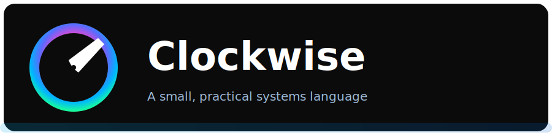

# Clockwise — a tiny, practical systems language
<p align="center">
	
</p>
Thanks for dropping by! Clockwise is my “keep-it-small” systems language
project. It stays intentionally tiny so you can read the whole stack in an
afternoon, ship self-contained native binaries, and still piggyback on the Go
toolchain for platform builds.

The language is intentionally simple and predictable: a C-like syntax, first-
class functions, and a small runtime implemented as plain Go helpers you can
inspect, extend, or replace.

This repository contains a working compiler (written in Go), a collection of
Go-based runtime helpers, developer tools (formatter and an installer builder),
and documentation. The compiler emits Go source from `.cw` files and uses
`go build` to produce native binaries, so you don't need a C toolchain.

Why Clockwise
- Small & predictable: minimal semantics and a tiny runtime.
- Fast iteration: generate Go and reuse the Go toolchain for builds and
	cross-compiles.
- Easy interop: runtime helpers are plain Go functions that are callable from
	generated code.

What you'll find here
- `cmd/` — CLI tools: `cwc` (compiler/toolchain), `cwfmt`, `cwdoc`, `installer`
  - `cwc build|run|fmt` for the usual workflow
  - `cwdoc` for fast Markdown/HTML/JSON docs out of your `.cw` files
  - `installer` for building the Windows CLI installer
- `lexer/`, `parser/`, `checker/`, `codegen/` — compiler internals
- `runtime/` — plain-Go helper libs pulled into generated code
- `docs/` — language spec, usage, and contributing notes

Quick start (you only need Go):

Windows PowerShell:
```powershell
# Build the compiler and tools (if you want the DIY route)
cd C:\path\to\ClockWise
go build -o bin\cwc.exe ./cmd/cw

# Or grab the ready-to-run installer (CLI)
# 1. Download the latest release artifact (or run .\build_installer.ps1)
# 2. Run bin\cw-windows-amd64.exe
```

Linux/macOS:
```bash
# Build the compiler and tools
cd /path/to/ClockWise
go build -o bin/cwc ./cmd/cw

# Install system-wide (requires sudo)
sudo cp bin/cwc /usr/local/bin/
```

Basic Usage

```bash
# Build a program
cwc build program.cw -o program

# Run directly without explicit build
cwc run program.cw --arg1 value1

# Format your code
cwc fmt -w *.cw  # Format all .cw files in current directory

# Show documentation
cwc doc package.cw
```

Example `program.cw`:
```go
package main

import "fmt"

func main() {
    fmt.Println("Hello, ClockWise!")
}
```

Note: the `examples/` folder has been removed from this repository. See
`docs/USAGE.md` for inline snippets and quick-start examples, or create your
own small `.cw` files to experiment.

## Installation

### Windows
1. Download `cw-windows-amd64.exe` from the releases tab
   (or build with `./build_installer.ps1`, artifact in `bin\cw-windows-amd64.exe`).
2. Per-user install (recommended, no admin):
   - Run: `bin\cw-windows-amd64.exe --dir "%LOCALAPPDATA%\Programs\Clockwise"`
3. System-wide install (admin):
   - Run in an elevated PowerShell: `bin\cw-windows-amd64.exe --system --dir "C:\\Program Files\\Clockwise"`
4. The installer copies `cw.exe`, updates your user PATH, and creates a Start Menu shortcut.
   If no bundled `cw.exe` is found, it automatically downloads the latest release.

### Linux/macOS
```bash
# Download and install
curl -L https://github.com/clockwise-lang/clockwise/releases/latest/download/install.sh | sh

# Or build from source
git clone https://codeberg.org/clockwise-lang/clockwise
cd clockwise
go build -o /usr/local/bin/cwc ./cmd/cw
```

### Building the installer yourself
From the repo root:

Windows PowerShell:
```powershell
./build_installer.ps1
# Produces `bin\cw-windows-amd64.exe`
```

Linux/macOS:
```bash
# (On Linux/macOS we don’t ship a GUI installer yet; use the scripts above.)
```

Installer flags (Windows):
- `--dir <path>` Install directory. Defaults to per-user `%LOCALAPPDATA%\Programs\Clockwise`.
- `--system` Install to Program Files (requires admin; triggers a one-time elevation).
- `--binary <path>` Use a specific `cw.exe`. If omitted, installer looks for a bundled binary or downloads the latest release.

### Documentation generation

`cwdoc` scans `.cw` files and spits out Markdown, HTML, or JSON summaries—you
can run it over your project like this:

```bash
cwdoc -dir ./examples -output docs/cwdoc -format markdown
```

Use `-single` if you prefer one combined file.


Donations
---------
If you like Clockwise and want to support its development, you can donate via Liberapay. Donations go to the project account `Listedroot`.


<a href="https://liberapay.com/Listedroot/donate" target="_blank" rel="noopener noreferrer">
	
</a>

License & rights
-----------------
This project is licensed under the MIT License. Copyright (c) 2025 BloodyHell-Industries-Inc.

Getting involved
----------------
See `docs/CONTRIBUTING.md` for how to file issues and contribute code. If you want new runtime helpers,
add them under `runtime/` (they're plain Go files and will be merged into generated modules).

Questions or want a feature fast? Open an issue or drop a PR—I try to keep
changes small, readable, and testable.
